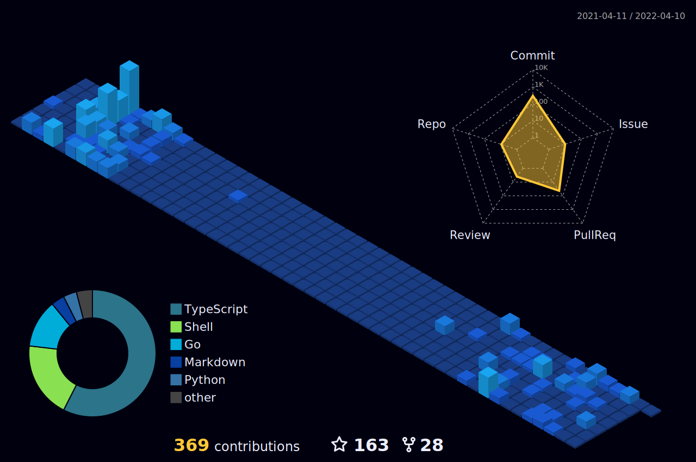

<!-- trungquandev -->

    
<h1 align="center"> Hi , I'm HưngPr0ject </h1>

  

  

  
  

  
 

> &nbsp;***Talking about Information***

-   🔭 My name is Nguyễn Phương Hưng.
-   🌱 **/**/****
-   💬 Love you all!
-   📥 ANIME NEVER DIE
-   😄 Pronouns: [He/His](https://pronoun.is/she)
-   ⚡ Fun fact: I like **Shinchan, sleeping, coding, listening to music, eating and blah blah blah**. I dislike everything except my likes!

# 🛠 Tech Stack

- 💻 &nbsp; TypeScript | JavaScript | PHP | HTML | CSS
- 🔧 &nbsp; Visual Studio code | Git
- 🖥 &nbsp; Adobe Photoshop | After Effect

# Languages and Tools

         </a>     

# Github Stats

# 📖 Top Langs

</a> 

  
 
<!-- trungquandev -->

#cre : Goatbot , Disme Pr0ject , Mirai  Pr0ject SOME GIT...
